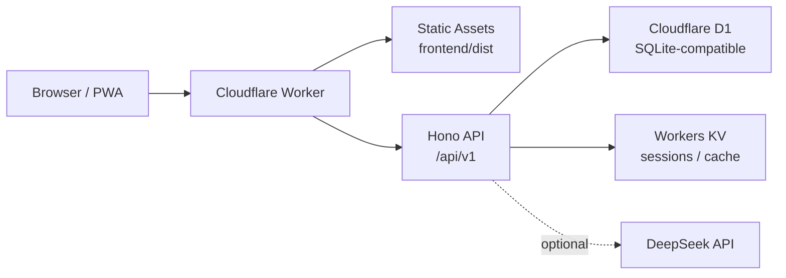

# Cloud-Vault


Cloud-Vault 是一个运行在 Cloudflare Workers 上的个人记账与账单管理应用。它把前端静态资源、API、数据库和会话存储都放在 Cloudflare 边缘网络中，适合个人或小团队低成本部署自己的财务工作台。

项目当前以中文体验为主，支持多账本、多账户、分类标签、预算、统计报表，以及支付宝 CSV / 微信支付 XLSX 账单导入。

## 目录

- [特性](#特性)
- [架构](#架构)
- [技术栈](#技术栈)
- [项目结构](#项目结构)
- [快速开始](#快速开始)
- [Cloudflare 部署](#cloudflare-部署)
- [D1 迁移](#d1-迁移)
- [环境变量](#环境变量)
- [常用命令](#常用命令)
- [安全说明](#安全说明)
- [开发路线](#开发路线)
- [许可证](#许可证)

## 特性

- 账本管理：支持多个账本、账户、分类、标签和预算。
- 交易记录：支持支出、收入、转账、软删除、恢复和批量改分类。
- 账单导入：支持支付宝交易明细 CSV、微信支付账单 XLSX，导入前可预览并跳过无效行。
- 自动去重：账单导入会记录来源平台与订单号，重复导入时尽量避免生成重复流水。
- 订单号字段：从支付宝 / 微信账单中提取订单号，交易详情页单独展示。
- 报表分析：基于 ECharts 展示收支趋势、分类占比和账户概览。
- 访问控制：支持邀请制注册、管理员后台、系统设置和会话管理。
- Cloudflare 原生：前端资源、Worker API、D1、KV 可以部署在同一个 Cloudflare 项目中。
- 可选 AI：预留 DeepSeek API 配置，用于后续扩展智能记账能力。

## 架构



Cloud-Vault 使用单 Worker 部署模式。Cloudflare Worker 先处理 API 请求，再托管前端构建产物。数据持久化放在 D1，登录态和轻量缓存放在 KV。

## 技术栈

| 层级 | 技术 |
| --- | --- |
| 前端 | Vue 3, TypeScript, Vite, Pinia, Vue Router, Vue I18n |
| UI / 图表 | Tailwind CSS, ECharts, Lucide Icons |
| 后端 | Cloudflare Workers, Hono, TypeScript |
| 数据 | Cloudflare D1, Workers KV |
| 校验 / 认证 | Zod, jose |
| 构建 | npm workspaces, Wrangler |
| 测试 | TypeScript check, Playwright visual test |

## 项目结构

```text
Cloud-Vault/
├── frontend/              # Vue 3 前端应用
│   ├── src/
│   └── vite.config.ts
├── worker/                # Cloudflare Worker API
│   ├── migrations/        # D1 数据库迁移
│   ├── src/
│   └── wrangler.toml
├── docs/                  # 补充部署文档
├── package.json           # npm workspace 入口
└── README.md
```

## 快速开始

### 前置要求

- Node.js 20 或更高版本
- npm
- Cloudflare 账号
- Wrangler 登录或 `CLOUDFLARE_API_TOKEN`

### 安装依赖

```powershell
npm install
```

### 配置前端环境

```powershell
Copy-Item .env.example .env
```

默认 API 地址是 `/api/v1`。本地开发如果前后端分开运行，可以按实际端口调整 `VITE_API_BASE_URL`。

### 启动本地开发

打开两个终端分别运行：

```powershell
npm run dev:worker
```

```powershell
npm run dev:frontend
```

本地 Worker 会使用 Wrangler 的本地 D1 / KV 环境。首次运行前建议先执行本地迁移：

```powershell
cmd /c node_modules\.bin\wrangler.cmd d1 migrations apply cloud-vault --local --config worker\wrangler.toml
```

macOS / Linux 可使用：

```bash
npx wrangler d1 migrations apply cloud-vault --local --config worker/wrangler.toml
```

## Cloudflare 部署

### 1. 创建 D1 数据库

如果是新的 Cloudflare 账号或 fork 后部署，先创建远程 D1：

```powershell
cmd /c node_modules\.bin\wrangler.cmd d1 create cloud-vault
```

Wrangler 会返回 `database_id`。把它写入 [worker/wrangler.toml](worker/wrangler.toml) 的 D1 配置中：

```toml
[[d1_databases]]
binding = "DB"
database_name = "cloud-vault"
database_id = "your-database-id"
migrations_dir = "migrations"
```

当前仓库里的 `database_id` 只对应作者自己的 Cloudflare D1 实例。它不是密钥，但其他账号部署时必须换成自己的 D1 ID。

### 2. 创建 KV 命名空间

创建一个 KV 命名空间，并在 Cloudflare Worker 设置里绑定：

| Binding | 用途 |
| --- | --- |
| `SESSION_KV` | 登录会话、短期状态和缓存 |

如果你使用 Wrangler 部署，也可以把 KV namespace id 写入 `worker/wrangler.toml`。

### 3. 配置变量和密钥

在 Cloudflare Dashboard 的 Worker 设置中添加变量。生产环境建议把密钥类配置放在 Secrets 中。

必填项：

| 变量 | 说明 |
| --- | --- |
| `jwt_secret` | JWT 签名密钥，建议使用长随机字符串 |
| `invite_hash_secret` | 邀请码哈希密钥 |
| `admin_email` | 初始管理员邮箱 |
| `registration_invite_code` | 首次注册邀请码 |

常用可选项：

| 变量 | 默认值 | 说明 |
| --- | --- | --- |
| `registration_mode` | `invite_only` | 注册模式：`invite_only` / `open` / `closed` |
| `default_currency` | `CNY` | 默认币种 |
| `default_locale` | `zh-CN` | 默认语言 |
| `deepseek_model` | `deepseek-chat` | AI 模型名称 |
| `deepseek_api_key` | 空 | DeepSeek API Key |

### 4. 执行远程 D1 迁移

```powershell
cmd /c node_modules\.bin\wrangler.cmd d1 migrations apply cloud-vault --remote --config worker\wrangler.toml
```

### 5. 构建并部署 Worker

```powershell
npm --workspace worker run deploy
```

部署完成后访问你的 Worker 域名或自定义域名。

### 6. 初始化系统

首次部署后访问：

```text
https://<your-domain>/api/init/<jwt_secret>
```

初始化完成后，用 `admin_email` 和 `registration_invite_code` 注册第一个管理员账号。

## D1 迁移

D1 表结构由 [worker/migrations](worker/migrations) 维护。开发和生产都建议通过 Wrangler 迁移，不要手动改生产数据库结构。

本地迁移：

```powershell
cmd /c node_modules\.bin\wrangler.cmd d1 migrations apply cloud-vault --local --config worker\wrangler.toml
```

远程迁移：

```powershell
cmd /c node_modules\.bin\wrangler.cmd d1 migrations apply cloud-vault --remote --config worker\wrangler.toml
```

查看远程数据库：

```powershell
cmd /c node_modules\.bin\wrangler.cmd d1 list
```

如果提示缺少 `database_id`，说明 `worker/wrangler.toml` 还没有绑定远程 D1 ID。先执行 `wrangler d1 create cloud-vault`，再把返回的 ID 写入配置。

## 环境变量

前端环境变量示例见 [.env.example](.env.example)。

| 变量 | 默认值 | 说明 |
| --- | --- | --- |
| `VITE_API_BASE_URL` | `/api/v1` | 前端请求 API 的基础路径 |
| `VITE_APP_NAME` | `Cloud-Vault` | 应用名称 |
| `VITE_DEFAULT_LOCALE` | `zh-CN` | 默认语言 |

Worker 侧变量主要在 [worker/wrangler.toml](worker/wrangler.toml) 和 Cloudflare Dashboard 中配置。生产密钥不要提交到仓库。

## 常用命令

| 命令 | 说明 |
| --- | --- |
| `npm install` | 安装 workspace 依赖 |
| `npm run dev:frontend` | 启动前端开发服务 |
| `npm run dev:worker` | 启动 Worker 本地开发服务 |
| `npm run build` | 构建所有 workspace |
| `npm run typecheck` | TypeScript 类型检查 |
| `npm run lint` | 运行 lint，如果 workspace 提供了 lint 脚本 |
| `npm --workspace worker run deploy` | 构建并部署 Worker |
| `npm run test:visual` | 运行 Playwright 视觉测试 |

## 安全说明

- 不要把 Cloudflare API Token、DeepSeek API Key、JWT 密钥或邀请码提交到仓库。
- 如果密钥已经暴露，应立即在对应平台撤销并重新生成。
- `database_id` 不是密钥，但它绑定到具体 Cloudflare 账号，fork 部署时应替换。
- 生产环境建议使用 `invite_only` 或 `closed` 注册模式。
- D1 迁移会影响线上数据库，执行远程迁移前确认目标账号和数据库名称。

## 开发路线

- 更完整的账单导入映射与重复记录审核。
- 定期账单和订阅管理。
- 多币种与汇率记录。
- 更细的预算周期和预算预警。
- 移动端交互优化。
- 自动化部署流程中的 D1 迁移检查。

## 贡献

目前项目仍处于个人项目阶段，但代码结构已按开源协作方式整理。提交变更前建议至少运行：

```powershell
npm run typecheck
npm run build
```

贡献时请尽量保持改动聚焦：一个 PR 解决一个问题，并在描述中说明验证方式。

## 许可证

当前仓库尚未声明开源许可证。正式公开分发前，建议添加 `LICENSE` 文件并明确使用条款。
