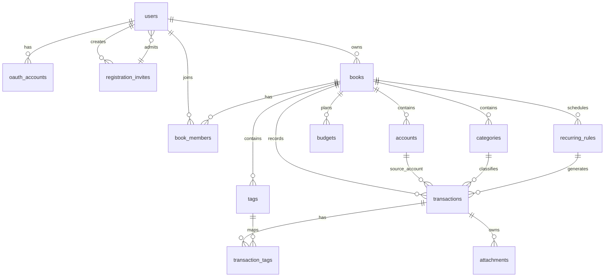

# Cloud-Vault 记账软件 数据库设计

## 一、设计目标

Cloud-Vault 的结构化数据统一存放在 Cloudflare D1。D1 本质是 Serverless SQLite，适合存储用户、账本、账户、分类、账单、预算、周期规则等关系型数据。

本设计需要同时满足三个目标：

1. 支撑 MVP：邀请码注册、初始管理员、用户登录、账户管理、分类管理、手动记账、账单筛选、基础统计。
2. 支撑 P1/P2 扩展：AI 记账、预算、周期账单、通知、附件、数据导出、共享账本。
3. 适配 Cloudflare 架构：D1 存结构化主数据，KV 存会话和缓存，R2 存票据图片和备份文件。

---

## 二、核心建模原则

### 2.1 以账本为数据隔离边界

虽然 MVP 可以只有个人用户，但需求中预留了家庭/团队共享账本。因此数据库不直接把账单只挂到 `user_id` 下，而是引入 `books` 账本表：

- 每个用户注册后自动创建一个默认个人账本。
- 账户、分类、标签、账单、预算都归属于某个 `book_id`。
- 后续共享账本只需要增加成员和权限，不需要大规模迁移账单数据。

### 2.2 金额使用整数存储

所有金额字段使用最小货币单位的整数存储，例如：

| 展示金额 | 数据库存储 |
|----------|------------|
| ¥35.00 | `3500` |
| $12.99 | `1299` |

避免浮点数精度问题。字段命名统一使用 `amount`、`opening_balance`、`cached_balance` 等，单位均为 minor unit。

### 2.3 时间使用 ISO 8601 文本

D1/SQLite 对 `TEXT` 排序友好，统一使用 UTC ISO 8601 字符串：

```text
2026-05-11T08:30:00.000Z
```

涉及报表分组时额外保存 `date_key`，格式为 `YYYY-MM-DD`，方便按天、月、年聚合。

### 2.4 账单软删除

账单、账户、分类、标签等核心数据使用 `deleted_at` 或 `archived_at` 标记，不直接物理删除：

- 支持误删 30 秒内恢复。
- 支持后续审计和数据导出。
- 账号注销时再按用户维度做彻底清理。

### 2.5 账户余额以账单为准

账户余额的权威来源是 `transactions`。`accounts.cached_balance` 只作为加速展示的缓存字段：

- 新增、编辑、删除账单时由应用层同步更新缓存余额。
- 出现不一致时可以通过账单流水重新计算。

### 2.6 注册邀请码只保存哈希

系统默认不开放自由注册。注册时必须填写管理员分发的邀请码：

- 部署时配置 `admin_email` 和 `registration_invite_code`。
- 初始化时将邀请码通过 HMAC-SHA256 等方式哈希后写入 `registration_invites`，明文只由部署者自己保存。
- 初始邀请码只允许 `admin_email` 使用一次，注册成功后该用户成为系统管理员。
- 后续普通用户邀请码由管理员在后台生成，可设置使用次数、过期时间和限定邮箱。

### 2.7 公共字段与审计字段规范

主表统一使用以下公共字段。D1/SQLite 层不依赖触发器自动维护时间字段，应用层 Service 在创建、更新、删除、归档时统一写入 `now()`，保证业务流程可控、测试可控。

| 字段 | 类型 | 适用范围 | 说明 |
|------|------|----------|------|
| `id` | TEXT | 所有主表 | 主键，建议 UUID/ULID |
| `created_at` | TEXT | 所有主表 | 创建时间，UTC ISO 8601 |
| `updated_at` | TEXT | 可编辑主表 | 更新时间，由 Service 层统一写入 |
| `created_by` | TEXT | 用户创建型数据 | 创建人用户 ID；系统初始化或系统预设数据可为空 |
| `updated_by` | TEXT | 管理后台、设置类、审计敏感数据 | 最后修改人用户 ID，可按需加入 |
| `deleted_at` | TEXT | 可恢复删除的数据 | 软删除标记，默认查询过滤 |
| `deleted_by` | TEXT | 需要审计删除人的数据 | 删除操作人用户 ID，MVP 可按敏感程度追加 |
| `archived_at` | TEXT | 基础资料类数据 | 归档/停用标记，保留历史引用 |
| `archived_by` | TEXT | 需要审计归档人的数据 | 归档操作人用户 ID，MVP 可按敏感程度追加 |

`deleted_at` 和 `archived_at` 的使用边界：

| 标记 | 适合对象 | 含义 |
|------|----------|------|
| `deleted_at` | 账单、预算、附件、通知、用户注销 | 用户执行删除，可恢复或后续物理清理 |
| `archived_at` | 账本、账户、分类、标签 | 基础资料停用，不再出现在新建选择项中，但历史账单仍可引用 |

时间写入规范：

- `created_at`：创建记录时写入。
- `updated_at`：任何业务字段变更时写入。
- `deleted_at`：软删除时写入，不直接物理删除。
- `archived_at`：归档基础资料时写入。
- 恢复删除或取消归档时，对应字段置空，并同步更新 `updated_at`。

---

## 三、实体关系概览



---

## 四、表结构设计

### 4.1 用户表：users

存储用户基础身份信息。OAuth 登录用户可以没有密码哈希。

| 字段 | 类型 | 约束 | 说明 |
|------|------|------|------|
| id | TEXT | PK | 用户 ID，建议使用 UUID/ULID |
| email | TEXT | UNIQUE, NOT NULL | 登录邮箱，大小写不敏感 |
| password_hash | TEXT | NULL | bcrypt 哈希，OAuth 用户可为空 |
| nickname | TEXT | NOT NULL | 昵称 |
| avatar_url | TEXT | NULL | 头像 URL |
| default_currency | TEXT | NOT NULL | 默认货币，如 CNY/USD |
| locale | TEXT | NOT NULL | 语言，如 zh-CN/en-US |
| timezone | TEXT | NOT NULL | 时区，如 Asia/Shanghai |
| system_role | TEXT | NOT NULL | 系统角色，admin/user |
| registration_invite_id | TEXT | FK, NULL | 注册时使用的邀请码 |
| email_verified_at | TEXT | NULL | 邮箱验证时间 |
| last_login_at | TEXT | NULL | 最后登录时间 |
| created_at | TEXT | NOT NULL | 创建时间 |
| updated_at | TEXT | NOT NULL | 更新时间 |
| deleted_at | TEXT | NULL | 注销时间 |

### 4.2 注册邀请码表：registration_invites

存储管理员分发的邀请码。数据库只保存哈希，不保存明文邀请码。

| 字段 | 类型 | 约束 | 说明 |
|------|------|------|------|
| id | TEXT | PK | 邀请码记录 ID |
| code_hash | TEXT | UNIQUE, NOT NULL | 邀请码哈希，基于规范化后的明文计算 |
| created_by | TEXT | FK, NULL | 创建管理员；部署初始化生成时可为空 |
| invite_role | TEXT | NOT NULL | 注册后系统角色，admin/user |
| allowed_email | TEXT | NULL | 限定可使用邮箱，初始管理员邀请码必须填写 |
| max_uses | INTEGER | NOT NULL | 最大使用次数 |
| used_count | INTEGER | NOT NULL | 已使用次数 |
| expires_at | TEXT | NULL | 过期时间 |
| status | TEXT | NOT NULL | active/disabled |
| note | TEXT | NULL | 备注 |
| created_at | TEXT | NOT NULL | 创建时间 |
| updated_at | TEXT | NOT NULL | 更新时间 |

邀请码规则：

- `used_count < max_uses` 才可继续使用。
- `expires_at` 为空表示不过期。
- `allowed_email` 不为空时，注册邮箱必须完全匹配。
- `invite_role = admin` 只用于部署初始化生成的首个管理员邀请码。

### 4.3 OAuth 账号表：oauth_accounts

支持 Google、GitHub 等第三方登录。

| 字段 | 类型 | 约束 | 说明 |
|------|------|------|------|
| id | TEXT | PK | 记录 ID |
| user_id | TEXT | FK | 关联用户 |
| provider | TEXT | NOT NULL | google/github |
| provider_user_id | TEXT | NOT NULL | 第三方平台用户 ID |
| provider_email | TEXT | NULL | 第三方返回邮箱 |
| created_at | TEXT | NOT NULL | 绑定时间 |

唯一约束：`provider + provider_user_id`。

### 4.4 账本表：books

账本是数据归属和权限控制的核心边界。

| 字段 | 类型 | 约束 | 说明 |
|------|------|------|------|
| id | TEXT | PK | 账本 ID |
| owner_user_id | TEXT | FK | 创建者/所有者 |
| name | TEXT | NOT NULL | 账本名称 |
| type | TEXT | NOT NULL | personal/shared |
| default_currency | TEXT | NOT NULL | 默认货币 |
| icon | TEXT | NULL | 账本图标 |
| created_at | TEXT | NOT NULL | 创建时间 |
| updated_at | TEXT | NOT NULL | 更新时间 |
| archived_at | TEXT | NULL | 归档时间 |

### 4.5 账本成员表：book_members

MVP 中只有 owner，一开始也建议落库，避免后续共享账本迁移。

| 字段 | 类型 | 约束 | 说明 |
|------|------|------|------|
| book_id | TEXT | PK, FK | 账本 ID |
| user_id | TEXT | PK, FK | 用户 ID |
| role | TEXT | NOT NULL | owner/admin/editor/viewer |
| status | TEXT | NOT NULL | active/invited/removed |
| joined_at | TEXT | NOT NULL | 加入时间 |

### 4.6 账户表：accounts

现金、银行卡、信用卡、电子钱包等都作为账户。

| 字段 | 类型 | 约束 | 说明 |
|------|------|------|------|
| id | TEXT | PK | 账户 ID |
| book_id | TEXT | FK, NOT NULL | 所属账本 |
| created_by | TEXT | FK, NOT NULL | 创建用户 |
| name | TEXT | NOT NULL | 账户名称 |
| type | TEXT | NOT NULL | cash/debit_card/credit_card/ewallet/savings/investment/other |
| currency | TEXT | NOT NULL | 账户币种 |
| opening_balance | INTEGER | NOT NULL | 初始余额 |
| cached_balance | INTEGER | NOT NULL | 缓存余额 |
| icon | TEXT | NULL | 图标 |
| color | TEXT | NULL | 颜色 |
| include_in_assets | INTEGER | NOT NULL | 是否计入净资产，0/1 |
| credit_limit | INTEGER | NULL | 信用额度，信用卡可用 |
| statement_day | INTEGER | NULL | 信用卡账单日，1-31 |
| repayment_day | INTEGER | NULL | 信用卡还款日，1-31 |
| sort_order | INTEGER | NOT NULL | 排序 |
| created_at | TEXT | NOT NULL | 创建时间 |
| updated_at | TEXT | NOT NULL | 更新时间 |
| archived_at | TEXT | NULL | 归档时间 |

### 4.7 分类表：categories

收入和支出分类共用一张表。预设分类也落在每个账本下，方便用户修改排序和图标。

| 字段 | 类型 | 约束 | 说明 |
|------|------|------|------|
| id | TEXT | PK | 分类 ID |
| book_id | TEXT | FK, NOT NULL | 所属账本 |
| created_by | TEXT | FK, NULL | 创建用户，系统预设可为空 |
| parent_id | TEXT | FK, NULL | 父分类，预留子分类 |
| name | TEXT | NOT NULL | 分类名称 |
| type | TEXT | NOT NULL | income/expense |
| icon | TEXT | NOT NULL | SVG 图标名或图标 key |
| color | TEXT | NULL | 分类颜色 |
| is_system | INTEGER | NOT NULL | 是否系统预设，0/1 |
| sort_order | INTEGER | NOT NULL | 排序 |
| created_at | TEXT | NOT NULL | 创建时间 |
| updated_at | TEXT | NOT NULL | 更新时间 |
| archived_at | TEXT | NULL | 归档时间 |

### 4.8 标签表：tags

标签用于账单多维筛选，如「差旅」「报销」「家庭」。

| 字段 | 类型 | 约束 | 说明 |
|------|------|------|------|
| id | TEXT | PK | 标签 ID |
| book_id | TEXT | FK, NOT NULL | 所属账本 |
| name | TEXT | NOT NULL | 标签名 |
| color | TEXT | NULL | 标签颜色 |
| created_at | TEXT | NOT NULL | 创建时间 |
| archived_at | TEXT | NULL | 归档时间 |

唯一约束：`book_id + name`。

### 4.9 商户表：merchants

商户是可选增强表，用于支出排行、AI 智能分类和搜索归一化。MVP 可以先只写 `transactions.merchant_name`，后续再补商户归一化。

| 字段 | 类型 | 约束 | 说明 |
|------|------|------|------|
| id | TEXT | PK | 商户 ID |
| book_id | TEXT | FK, NOT NULL | 所属账本 |
| name | TEXT | NOT NULL | 展示名称 |
| normalized_name | TEXT | NOT NULL | 搜索归一化名称 |
| default_category_id | TEXT | FK, NULL | 默认分类 |
| created_at | TEXT | NOT NULL | 创建时间 |
| updated_at | TEXT | NOT NULL | 更新时间 |

### 4.10 账单表：transactions

核心流水表，支持收入、支出和转账。

| 字段 | 类型 | 约束 | 说明 |
|------|------|------|------|
| id | TEXT | PK | 账单 ID |
| book_id | TEXT | FK, NOT NULL | 所属账本 |
| created_by | TEXT | FK, NOT NULL | 创建用户 |
| account_id | TEXT | FK, NOT NULL | 主账户。支出/收入账户，转账转出账户 |
| transfer_account_id | TEXT | FK, NULL | 转账转入账户 |
| category_id | TEXT | FK, NULL | 分类，转账可为空 |
| merchant_id | TEXT | FK, NULL | 商户 |
| type | TEXT | NOT NULL | expense/income/transfer |
| amount | INTEGER | NOT NULL | 原币种金额，必须大于 0 |
| currency | TEXT | NOT NULL | 原币种 |
| base_amount | INTEGER | NOT NULL | 换算到账本默认币种后的金额 |
| base_currency | TEXT | NOT NULL | 账本默认币种 |
| fx_rate | TEXT | NULL | 汇率字符串，避免浮点精度问题 |
| occurred_at | TEXT | NOT NULL | 发生时间 |
| date_key | TEXT | NOT NULL | 日期键，YYYY-MM-DD |
| note | TEXT | NULL | 备注 |
| merchant_name | TEXT | NULL | 冗余商户名，便于搜索和历史保留 |
| source | TEXT | NOT NULL | manual/ai/import/recurring |
| status | TEXT | NOT NULL | posted/pending/void |
| refund_of_transaction_id | TEXT | FK, NULL | 退款关联原账单 |
| recurring_rule_id | TEXT | FK, NULL | 周期规则来源 |
| created_at | TEXT | NOT NULL | 创建时间 |
| updated_at | TEXT | NOT NULL | 更新时间 |
| deleted_at | TEXT | NULL | 删除时间 |

账单金额规则：

| type | account_id | transfer_account_id | category_id | 余额影响 |
|------|------------|---------------------|-------------|----------|
| expense | 支出账户 | NULL | 支出分类 | account 减少 |
| income | 收入账户 | NULL | 收入分类 | account 增加 |
| transfer | 转出账户 | 转入账户 | NULL | 转出减少，转入增加 |

### 4.11 账单标签关联表：transaction_tags

| 字段 | 类型 | 约束 | 说明 |
|------|------|------|------|
| transaction_id | TEXT | PK, FK | 账单 ID |
| tag_id | TEXT | PK, FK | 标签 ID |
| book_id | TEXT | FK, NOT NULL | 所属账本，便于按账本查询 |

### 4.12 预算表：budgets

支持月度总预算和分类预算。

| 字段 | 类型 | 约束 | 说明 |
|------|------|------|------|
| id | TEXT | PK | 预算 ID |
| book_id | TEXT | FK, NOT NULL | 所属账本 |
| created_by | TEXT | FK, NOT NULL | 创建用户 |
| category_id | TEXT | FK, NULL | 分类预算；为空表示总预算 |
| period_type | TEXT | NOT NULL | monthly/yearly/custom |
| period_start | TEXT | NOT NULL | 周期开始日期，YYYY-MM-DD |
| period_end | TEXT | NOT NULL | 周期结束日期，YYYY-MM-DD |
| amount | INTEGER | NOT NULL | 预算金额 |
| currency | TEXT | NOT NULL | 预算币种 |
| threshold_percent | INTEGER | NOT NULL | 提醒阈值，如 80 |
| created_at | TEXT | NOT NULL | 创建时间 |
| updated_at | TEXT | NOT NULL | 更新时间 |
| deleted_at | TEXT | NULL | 删除时间 |

### 4.13 周期账单规则表：recurring_rules

用于房租、订阅、工资等固定周期账单。

| 字段 | 类型 | 约束 | 说明 |
|------|------|------|------|
| id | TEXT | PK | 规则 ID |
| book_id | TEXT | FK, NOT NULL | 所属账本 |
| created_by | TEXT | FK, NOT NULL | 创建用户 |
| name | TEXT | NOT NULL | 规则名称 |
| type | TEXT | NOT NULL | expense/income/transfer |
| account_id | TEXT | FK, NOT NULL | 主账户 |
| transfer_account_id | TEXT | FK, NULL | 转入账户 |
| category_id | TEXT | FK, NULL | 分类 |
| merchant_id | TEXT | FK, NULL | 商户 |
| amount | INTEGER | NOT NULL | 金额 |
| currency | TEXT | NOT NULL | 币种 |
| note | TEXT | NULL | 备注模板 |
| frequency | TEXT | NOT NULL | daily/weekly/monthly/yearly |
| interval_count | INTEGER | NOT NULL | 间隔数量，如每 2 周 |
| start_date | TEXT | NOT NULL | 开始日期 |
| end_date | TEXT | NULL | 结束日期 |
| next_run_date | TEXT | NOT NULL | 下次生成日期 |
| timezone | TEXT | NOT NULL | 时区 |
| status | TEXT | NOT NULL | active/paused/ended |
| created_at | TEXT | NOT NULL | 创建时间 |
| updated_at | TEXT | NOT NULL | 更新时间 |

### 4.14 附件表：attachments

文件本体存 R2，D1 只保存元数据。

| 字段 | 类型 | 约束 | 说明 |
|------|------|------|------|
| id | TEXT | PK | 附件 ID |
| book_id | TEXT | FK, NOT NULL | 所属账本 |
| transaction_id | TEXT | FK, NOT NULL | 关联账单 |
| created_by | TEXT | FK, NOT NULL | 上传用户 |
| r2_key | TEXT | UNIQUE, NOT NULL | R2 对象 key |
| file_name | TEXT | NOT NULL | 原文件名 |
| mime_type | TEXT | NOT NULL | 文件类型 |
| size_bytes | INTEGER | NOT NULL | 文件大小 |
| width | INTEGER | NULL | 图片宽度 |
| height | INTEGER | NULL | 图片高度 |
| created_at | TEXT | NOT NULL | 上传时间 |
| deleted_at | TEXT | NULL | 删除时间 |

### 4.15 AI 解析日志表：ai_parse_logs

用于自然语言记账调试和效果分析。注意隐私，建议只保留最近 30-90 天。

| 字段 | 类型 | 约束 | 说明 |
|------|------|------|------|
| id | TEXT | PK | 日志 ID |
| user_id | TEXT | FK, NOT NULL | 用户 ID |
| book_id | TEXT | FK, NOT NULL | 账本 ID |
| input_text | TEXT | NOT NULL | 用户输入 |
| parsed_json | TEXT | NULL | AI 解析结果 JSON |
| model | TEXT | NULL | 模型名称 |
| confidence | INTEGER | NULL | 置信度，0-100 |
| transaction_id | TEXT | FK, NULL | 最终生成账单 |
| status | TEXT | NOT NULL | success/failed/confirmed/rejected |
| created_at | TEXT | NOT NULL | 创建时间 |

### 4.16 通知任务表：notifications

预算超支、信用卡还款、周期账单等提醒可落表，推送状态可追踪。

| 字段 | 类型 | 约束 | 说明 |
|------|------|------|------|
| id | TEXT | PK | 通知 ID |
| user_id | TEXT | FK, NOT NULL | 接收用户 |
| book_id | TEXT | FK, NULL | 关联账本 |
| type | TEXT | NOT NULL | budget/card/recurring/daily |
| title | TEXT | NOT NULL | 标题 |
| body | TEXT | NOT NULL | 内容 |
| ref_type | TEXT | NULL | 关联对象类型 |
| ref_id | TEXT | NULL | 关联对象 ID |
| scheduled_at | TEXT | NOT NULL | 计划发送时间 |
| sent_at | TEXT | NULL | 实际发送时间 |
| status | TEXT | NOT NULL | pending/sent/failed/canceled |
| created_at | TEXT | NOT NULL | 创建时间 |

### 4.17 系统设置表：system_settings

保存全局配置。部署变量负责首次初始化，运行期设置以 D1 为准。

| 字段 | 类型 | 约束 | 说明 |
|------|------|------|------|
| key | TEXT | PK | 配置键，如 registration_mode |
| value | TEXT | NOT NULL | 配置值 |
| value_type | TEXT | NOT NULL | string/number/boolean/json |
| description | TEXT | NULL | 配置说明 |
| updated_by | TEXT | FK, NULL | 最后修改管理员 |
| updated_at | TEXT | NOT NULL | 更新时间 |

---

## 五、D1 建表 SQL 草案

> 说明：以下 SQL 可拆分为 `0001_init.sql`。生产迁移建议使用 Wrangler D1 migrations 管理。

```sql
PRAGMA foreign_keys = ON;

CREATE TABLE users (
  id TEXT PRIMARY KEY,
  email TEXT NOT NULL COLLATE NOCASE UNIQUE,
  password_hash TEXT,
  nickname TEXT NOT NULL,
  avatar_url TEXT,
  default_currency TEXT NOT NULL DEFAULT 'CNY',
  locale TEXT NOT NULL DEFAULT 'zh-CN',
  timezone TEXT NOT NULL DEFAULT 'Asia/Shanghai',
  system_role TEXT NOT NULL DEFAULT 'user' CHECK (system_role IN ('admin', 'user')),
  registration_invite_id TEXT,
  email_verified_at TEXT,
  last_login_at TEXT,
  created_at TEXT NOT NULL,
  updated_at TEXT NOT NULL,
  deleted_at TEXT,
  FOREIGN KEY (registration_invite_id) REFERENCES registration_invites(id)
);

CREATE TABLE registration_invites (
  id TEXT PRIMARY KEY,
  code_hash TEXT NOT NULL UNIQUE,
  created_by TEXT,
  invite_role TEXT NOT NULL DEFAULT 'user' CHECK (invite_role IN ('admin', 'user')),
  allowed_email TEXT COLLATE NOCASE,
  max_uses INTEGER NOT NULL DEFAULT 1 CHECK (max_uses > 0),
  used_count INTEGER NOT NULL DEFAULT 0 CHECK (used_count >= 0),
  expires_at TEXT,
  status TEXT NOT NULL DEFAULT 'active' CHECK (status IN ('active', 'disabled')),
  note TEXT,
  created_at TEXT NOT NULL,
  updated_at TEXT NOT NULL,
  CHECK (used_count <= max_uses),
  FOREIGN KEY (created_by) REFERENCES users(id)
);

CREATE TABLE oauth_accounts (
  id TEXT PRIMARY KEY,
  user_id TEXT NOT NULL,
  provider TEXT NOT NULL CHECK (provider IN ('google', 'github')),
  provider_user_id TEXT NOT NULL,
  provider_email TEXT,
  created_at TEXT NOT NULL,
  UNIQUE (provider, provider_user_id),
  FOREIGN KEY (user_id) REFERENCES users(id) ON DELETE CASCADE
);

CREATE TABLE books (
  id TEXT PRIMARY KEY,
  owner_user_id TEXT NOT NULL,
  name TEXT NOT NULL,
  type TEXT NOT NULL DEFAULT 'personal' CHECK (type IN ('personal', 'shared')),
  default_currency TEXT NOT NULL DEFAULT 'CNY',
  icon TEXT,
  created_at TEXT NOT NULL,
  updated_at TEXT NOT NULL,
  archived_at TEXT,
  FOREIGN KEY (owner_user_id) REFERENCES users(id)
);

CREATE TABLE book_members (
  book_id TEXT NOT NULL,
  user_id TEXT NOT NULL,
  role TEXT NOT NULL CHECK (role IN ('owner', 'admin', 'editor', 'viewer')),
  status TEXT NOT NULL DEFAULT 'active' CHECK (status IN ('active', 'invited', 'removed')),
  joined_at TEXT NOT NULL,
  PRIMARY KEY (book_id, user_id),
  FOREIGN KEY (book_id) REFERENCES books(id) ON DELETE CASCADE,
  FOREIGN KEY (user_id) REFERENCES users(id) ON DELETE CASCADE
);

CREATE TABLE accounts (
  id TEXT PRIMARY KEY,
  book_id TEXT NOT NULL,
  created_by TEXT NOT NULL,
  name TEXT NOT NULL,
  type TEXT NOT NULL CHECK (type IN ('cash', 'debit_card', 'credit_card', 'ewallet', 'savings', 'investment', 'other')),
  currency TEXT NOT NULL DEFAULT 'CNY',
  opening_balance INTEGER NOT NULL DEFAULT 0,
  cached_balance INTEGER NOT NULL DEFAULT 0,
  icon TEXT,
  color TEXT,
  include_in_assets INTEGER NOT NULL DEFAULT 1 CHECK (include_in_assets IN (0, 1)),
  credit_limit INTEGER,
  statement_day INTEGER CHECK (statement_day IS NULL OR statement_day BETWEEN 1 AND 31),
  repayment_day INTEGER CHECK (repayment_day IS NULL OR repayment_day BETWEEN 1 AND 31),
  sort_order INTEGER NOT NULL DEFAULT 0,
  created_at TEXT NOT NULL,
  updated_at TEXT NOT NULL,
  archived_at TEXT,
  FOREIGN KEY (book_id) REFERENCES books(id) ON DELETE CASCADE,
  FOREIGN KEY (created_by) REFERENCES users(id)
);

CREATE TABLE categories (
  id TEXT PRIMARY KEY,
  book_id TEXT NOT NULL,
  created_by TEXT,
  parent_id TEXT,
  name TEXT NOT NULL,
  type TEXT NOT NULL CHECK (type IN ('income', 'expense')),
  icon TEXT NOT NULL,
  color TEXT,
  is_system INTEGER NOT NULL DEFAULT 0 CHECK (is_system IN (0, 1)),
  sort_order INTEGER NOT NULL DEFAULT 0,
  created_at TEXT NOT NULL,
  updated_at TEXT NOT NULL,
  archived_at TEXT,
  FOREIGN KEY (book_id) REFERENCES books(id) ON DELETE CASCADE,
  FOREIGN KEY (created_by) REFERENCES users(id),
  FOREIGN KEY (parent_id) REFERENCES categories(id)
);

CREATE TABLE tags (
  id TEXT PRIMARY KEY,
  book_id TEXT NOT NULL,
  name TEXT NOT NULL,
  color TEXT,
  created_at TEXT NOT NULL,
  archived_at TEXT,
  UNIQUE (book_id, name),
  FOREIGN KEY (book_id) REFERENCES books(id) ON DELETE CASCADE
);

CREATE TABLE merchants (
  id TEXT PRIMARY KEY,
  book_id TEXT NOT NULL,
  name TEXT NOT NULL,
  normalized_name TEXT NOT NULL,
  default_category_id TEXT,
  created_at TEXT NOT NULL,
  updated_at TEXT NOT NULL,
  UNIQUE (book_id, normalized_name),
  FOREIGN KEY (book_id) REFERENCES books(id) ON DELETE CASCADE,
  FOREIGN KEY (default_category_id) REFERENCES categories(id)
);

CREATE TABLE recurring_rules (
  id TEXT PRIMARY KEY,
  book_id TEXT NOT NULL,
  created_by TEXT NOT NULL,
  name TEXT NOT NULL,
  type TEXT NOT NULL CHECK (type IN ('expense', 'income', 'transfer')),
  account_id TEXT NOT NULL,
  transfer_account_id TEXT,
  category_id TEXT,
  merchant_id TEXT,
  amount INTEGER NOT NULL CHECK (amount > 0),
  currency TEXT NOT NULL DEFAULT 'CNY',
  note TEXT,
  frequency TEXT NOT NULL CHECK (frequency IN ('daily', 'weekly', 'monthly', 'yearly')),
  interval_count INTEGER NOT NULL DEFAULT 1 CHECK (interval_count > 0),
  start_date TEXT NOT NULL,
  end_date TEXT,
  next_run_date TEXT NOT NULL,
  timezone TEXT NOT NULL DEFAULT 'Asia/Shanghai',
  status TEXT NOT NULL DEFAULT 'active' CHECK (status IN ('active', 'paused', 'ended')),
  created_at TEXT NOT NULL,
  updated_at TEXT NOT NULL,
  FOREIGN KEY (book_id) REFERENCES books(id) ON DELETE CASCADE,
  FOREIGN KEY (created_by) REFERENCES users(id),
  FOREIGN KEY (account_id) REFERENCES accounts(id),
  FOREIGN KEY (transfer_account_id) REFERENCES accounts(id),
  FOREIGN KEY (category_id) REFERENCES categories(id),
  FOREIGN KEY (merchant_id) REFERENCES merchants(id)
);

CREATE TABLE transactions (
  id TEXT PRIMARY KEY,
  book_id TEXT NOT NULL,
  created_by TEXT NOT NULL,
  account_id TEXT NOT NULL,
  transfer_account_id TEXT,
  category_id TEXT,
  merchant_id TEXT,
  type TEXT NOT NULL CHECK (type IN ('expense', 'income', 'transfer')),
  amount INTEGER NOT NULL CHECK (amount > 0),
  currency TEXT NOT NULL DEFAULT 'CNY',
  base_amount INTEGER NOT NULL CHECK (base_amount > 0),
  base_currency TEXT NOT NULL DEFAULT 'CNY',
  fx_rate TEXT,
  occurred_at TEXT NOT NULL,
  date_key TEXT NOT NULL,
  note TEXT,
  merchant_name TEXT,
  source TEXT NOT NULL DEFAULT 'manual' CHECK (source IN ('manual', 'ai', 'import', 'recurring')),
  status TEXT NOT NULL DEFAULT 'posted' CHECK (status IN ('posted', 'pending', 'void')),
  refund_of_transaction_id TEXT,
  recurring_rule_id TEXT,
  created_at TEXT NOT NULL,
  updated_at TEXT NOT NULL,
  deleted_at TEXT,
  CHECK (
    (type IN ('expense', 'income') AND transfer_account_id IS NULL AND category_id IS NOT NULL)
    OR
    (type = 'transfer' AND transfer_account_id IS NOT NULL AND category_id IS NULL AND transfer_account_id <> account_id)
  ),
  FOREIGN KEY (book_id) REFERENCES books(id) ON DELETE CASCADE,
  FOREIGN KEY (created_by) REFERENCES users(id),
  FOREIGN KEY (account_id) REFERENCES accounts(id),
  FOREIGN KEY (transfer_account_id) REFERENCES accounts(id),
  FOREIGN KEY (category_id) REFERENCES categories(id),
  FOREIGN KEY (merchant_id) REFERENCES merchants(id),
  FOREIGN KEY (refund_of_transaction_id) REFERENCES transactions(id),
  FOREIGN KEY (recurring_rule_id) REFERENCES recurring_rules(id)
);

CREATE TABLE transaction_tags (
  transaction_id TEXT NOT NULL,
  tag_id TEXT NOT NULL,
  book_id TEXT NOT NULL,
  PRIMARY KEY (transaction_id, tag_id),
  FOREIGN KEY (transaction_id) REFERENCES transactions(id) ON DELETE CASCADE,
  FOREIGN KEY (tag_id) REFERENCES tags(id) ON DELETE CASCADE,
  FOREIGN KEY (book_id) REFERENCES books(id) ON DELETE CASCADE
);

CREATE TABLE budgets (
  id TEXT PRIMARY KEY,
  book_id TEXT NOT NULL,
  created_by TEXT NOT NULL,
  category_id TEXT,
  period_type TEXT NOT NULL CHECK (period_type IN ('monthly', 'yearly', 'custom')),
  period_start TEXT NOT NULL,
  period_end TEXT NOT NULL,
  amount INTEGER NOT NULL CHECK (amount > 0),
  currency TEXT NOT NULL DEFAULT 'CNY',
  threshold_percent INTEGER NOT NULL DEFAULT 80 CHECK (threshold_percent BETWEEN 1 AND 100),
  created_at TEXT NOT NULL,
  updated_at TEXT NOT NULL,
  deleted_at TEXT,
  FOREIGN KEY (book_id) REFERENCES books(id) ON DELETE CASCADE,
  FOREIGN KEY (created_by) REFERENCES users(id),
  FOREIGN KEY (category_id) REFERENCES categories(id)
);

CREATE TABLE attachments (
  id TEXT PRIMARY KEY,
  book_id TEXT NOT NULL,
  transaction_id TEXT NOT NULL,
  created_by TEXT NOT NULL,
  r2_key TEXT NOT NULL UNIQUE,
  file_name TEXT NOT NULL,
  mime_type TEXT NOT NULL,
  size_bytes INTEGER NOT NULL CHECK (size_bytes > 0),
  width INTEGER,
  height INTEGER,
  created_at TEXT NOT NULL,
  deleted_at TEXT,
  FOREIGN KEY (book_id) REFERENCES books(id) ON DELETE CASCADE,
  FOREIGN KEY (transaction_id) REFERENCES transactions(id) ON DELETE CASCADE,
  FOREIGN KEY (created_by) REFERENCES users(id)
);

CREATE TABLE ai_parse_logs (
  id TEXT PRIMARY KEY,
  user_id TEXT NOT NULL,
  book_id TEXT NOT NULL,
  input_text TEXT NOT NULL,
  parsed_json TEXT,
  model TEXT,
  confidence INTEGER CHECK (confidence IS NULL OR confidence BETWEEN 0 AND 100),
  transaction_id TEXT,
  status TEXT NOT NULL CHECK (status IN ('success', 'failed', 'confirmed', 'rejected')),
  created_at TEXT NOT NULL,
  FOREIGN KEY (user_id) REFERENCES users(id) ON DELETE CASCADE,
  FOREIGN KEY (book_id) REFERENCES books(id) ON DELETE CASCADE,
  FOREIGN KEY (transaction_id) REFERENCES transactions(id)
);

CREATE TABLE notifications (
  id TEXT PRIMARY KEY,
  user_id TEXT NOT NULL,
  book_id TEXT,
  type TEXT NOT NULL CHECK (type IN ('budget', 'card', 'recurring', 'daily')),
  title TEXT NOT NULL,
  body TEXT NOT NULL,
  ref_type TEXT,
  ref_id TEXT,
  scheduled_at TEXT NOT NULL,
  sent_at TEXT,
  status TEXT NOT NULL DEFAULT 'pending' CHECK (status IN ('pending', 'sent', 'failed', 'canceled')),
  created_at TEXT NOT NULL,
  FOREIGN KEY (user_id) REFERENCES users(id) ON DELETE CASCADE,
  FOREIGN KEY (book_id) REFERENCES books(id) ON DELETE CASCADE
);

CREATE TABLE system_settings (
  key TEXT PRIMARY KEY,
  value TEXT NOT NULL,
  value_type TEXT NOT NULL DEFAULT 'string' CHECK (value_type IN ('string', 'number', 'boolean', 'json')),
  description TEXT,
  updated_by TEXT,
  updated_at TEXT NOT NULL,
  FOREIGN KEY (updated_by) REFERENCES users(id)
);
```

---

## 六、索引设计

```sql
CREATE INDEX idx_users_system_role ON users(system_role, deleted_at);

CREATE INDEX idx_registration_invites_status ON registration_invites(status, expires_at);
CREATE INDEX idx_registration_invites_created_by ON registration_invites(created_by, created_at DESC);

CREATE INDEX idx_oauth_accounts_user ON oauth_accounts(user_id);

CREATE INDEX idx_books_owner ON books(owner_user_id);
CREATE INDEX idx_book_members_user ON book_members(user_id, status);

CREATE INDEX idx_accounts_book ON accounts(book_id, archived_at, sort_order);

CREATE INDEX idx_categories_book_type ON categories(book_id, type, archived_at, sort_order);
CREATE INDEX idx_categories_parent ON categories(parent_id);

CREATE INDEX idx_tags_book ON tags(book_id, archived_at);

CREATE INDEX idx_merchants_book_name ON merchants(book_id, normalized_name);

CREATE INDEX idx_transactions_book_date ON transactions(book_id, date_key DESC, occurred_at DESC);
CREATE INDEX idx_transactions_account_date ON transactions(account_id, date_key DESC);
CREATE INDEX idx_transactions_transfer_account_date ON transactions(transfer_account_id, date_key DESC);
CREATE INDEX idx_transactions_category_date ON transactions(category_id, date_key DESC);
CREATE INDEX idx_transactions_type_date ON transactions(book_id, type, date_key DESC);
CREATE INDEX idx_transactions_merchant ON transactions(book_id, merchant_name);
CREATE INDEX idx_transactions_recurring ON transactions(recurring_rule_id);
CREATE INDEX idx_transactions_not_deleted ON transactions(book_id, deleted_at, date_key DESC);

CREATE INDEX idx_transaction_tags_tag ON transaction_tags(tag_id);
CREATE INDEX idx_transaction_tags_book ON transaction_tags(book_id, tag_id);

CREATE INDEX idx_budgets_book_period ON budgets(book_id, period_start, period_end);
CREATE INDEX idx_budgets_category_period ON budgets(category_id, period_start, period_end);

CREATE INDEX idx_recurring_rules_next_run ON recurring_rules(status, next_run_date);

CREATE INDEX idx_attachments_transaction ON attachments(transaction_id, deleted_at);

CREATE INDEX idx_ai_parse_logs_user_created ON ai_parse_logs(user_id, created_at DESC);

CREATE INDEX idx_notifications_schedule ON notifications(status, scheduled_at);
CREATE INDEX idx_notifications_user ON notifications(user_id, status, scheduled_at DESC);
```

索引策略说明：

- 账单列表最常用查询是 `book_id + date_key DESC`。
- 账户详情最常用查询是 `account_id + date_key DESC`。
- 统计图常按 `book_id + type + date_key` 聚合。
- 搜索备注/商户名如果后续数据量较大，可增加 SQLite FTS5 虚拟表；MVP 先用普通 `LIKE`。

---

## 七、常用查询示例

### 7.1 查询账单列表

```sql
SELECT
  t.*,
  a.name AS account_name,
  ta.name AS transfer_account_name,
  c.name AS category_name,
  c.icon AS category_icon
FROM transactions t
JOIN accounts a ON a.id = t.account_id
LEFT JOIN accounts ta ON ta.id = t.transfer_account_id
LEFT JOIN categories c ON c.id = t.category_id
WHERE t.book_id = ?
  AND t.deleted_at IS NULL
  AND t.date_key BETWEEN ? AND ?
ORDER BY t.occurred_at DESC
LIMIT ? OFFSET ?;
```

### 7.2 月度收支汇总

```sql
SELECT
  type,
  SUM(base_amount) AS total_amount
FROM transactions
WHERE book_id = ?
  AND deleted_at IS NULL
  AND status = 'posted'
  AND type IN ('income', 'expense')
  AND date_key BETWEEN ? AND ?
GROUP BY type;
```

### 7.3 分类支出占比

```sql
SELECT
  c.id AS category_id,
  c.name AS category_name,
  c.icon AS category_icon,
  SUM(t.base_amount) AS total_amount
FROM transactions t
JOIN categories c ON c.id = t.category_id
WHERE t.book_id = ?
  AND t.deleted_at IS NULL
  AND t.status = 'posted'
  AND t.type = 'expense'
  AND t.date_key BETWEEN ? AND ?
GROUP BY c.id
ORDER BY total_amount DESC;
```

### 7.4 重新计算账户余额

```sql
SELECT
  a.id,
  a.opening_balance
  + COALESCE(SUM(
      CASE
        WHEN t.type = 'income' AND t.account_id = a.id THEN t.amount
        WHEN t.type = 'expense' AND t.account_id = a.id THEN -t.amount
        WHEN t.type = 'transfer' AND t.account_id = a.id THEN -t.amount
        WHEN t.type = 'transfer' AND t.transfer_account_id = a.id THEN t.amount
        ELSE 0
      END
    ), 0) AS calculated_balance
FROM accounts a
LEFT JOIN transactions t
  ON (t.account_id = a.id OR t.transfer_account_id = a.id)
  AND t.deleted_at IS NULL
  AND t.status = 'posted'
WHERE a.book_id = ?
GROUP BY a.id;
```

### 7.5 校验注册邀请码

后端收到明文邀请码后，先做规范化和哈希，再查询 D1。明文邀请码不能入库。

```sql
SELECT *
FROM registration_invites
WHERE code_hash = ?
  AND status = 'active'
  AND used_count < max_uses
  AND (expires_at IS NULL OR expires_at > ?)
  AND (allowed_email IS NULL OR allowed_email = ?)
LIMIT 1;
```

注册成功后，在同一事务中创建用户并增加邀请码使用次数：

```sql
UPDATE registration_invites
SET used_count = used_count + 1,
    updated_at = ?
WHERE id = ?
  AND used_count < max_uses;
```

---

## 八、KV 与 R2 数据边界

### 8.1 Cloudflare KV

KV 不作为权威数据库，只存高频、短生命周期或可重建数据。

| Key | Value | TTL | 说明 |
|-----|-------|-----|------|
| `session:{jti}` | `{ userId, expiresAt }` | 登录有效期 | JWT 会话状态/撤销 |
| `password_reset:{token}` | `{ userId }` | 10-30 分钟 | 密码重置 |
| `email_verify:{token}` | `{ userId, email }` | 24 小时 | 邮箱验证 |
| `user_pref:{userId}` | 用户偏好 JSON | 可选 | 高频读取配置缓存 |
| `rate_limit:{ip}:{route}` | 计数器 | 短 TTL | API 限流 |
| `rate_limit:register:{ip}` | 计数器 | 短 TTL | 注册和邀请码尝试限流 |
| `init_lock` | `{ initializedAt }` | 不过期 | 可选，标记初始化已完成 |
| `ai_parse_cache:{hash}` | AI 解析结果 | 1-24 小时 | 可选，降低重复解析成本 |

### 8.2 Cloudflare R2

R2 存储二进制文件，D1 保存元数据。

| 用途 | R2 Key 建议 |
|------|-------------|
| 票据/收据图片 | `receipts/{bookId}/{transactionId}/{attachmentId}.{ext}` |
| 用户头像 | `avatars/{userId}/{assetId}.{ext}` |
| 数据导出文件 | `exports/{userId}/{jobId}.{ext}` |
| 数据备份文件 | `backups/{userId}/{backupId}.zip` |

---

## 九、初始化数据建议

### 9.1 部署初始化

部署阶段参考 `cloud-mail` 的初始化方式，配置管理员邮箱和初始化邀请码：

| 配置项 | 说明 |
|--------|------|
| `admin_email` | 初始系统管理员邮箱 |
| `registration_invite_code` | 初始管理员邀请码 |
| `jwt_secret` | JWT 签名密钥，也用于 `/api/init/:secret` 校验 |
| `invite_hash_secret` | 邀请码 HMAC 哈希密钥；MVP 可临时复用 `jwt_secret` |

调用 `/api/init/:secret` 时应完成：

1. 校验 `secret` 是否等于 `jwt_secret`。
2. 执行 D1 migrations。
3. 将 `registration_invite_code` 规范化并哈希。
4. 插入一条 `registration_invites`：`invite_role = admin`、`allowed_email = admin_email`、`max_uses = 1`。
5. 写入默认系统设置：注册模式为 `invite_only`。

### 9.2 用户注册初始化

用户注册完成后应在一个事务中初始化：

1. 校验 `registration_invites`，确认邀请码有效。
2. 创建 `users`，记录 `registration_invite_id` 和 `system_role`。
3. 将邀请码 `used_count + 1`。
4. 创建默认 `books`，名称可为「我的账本」。
5. 创建 `book_members`，角色为 `owner`。
6. 创建默认账户，例如「现金」。
7. 创建预设收入/支出分类。

预设支出分类：

| 名称 | 图标建议 |
|------|----------|
| 餐饮 | utensils |
| 交通 | car |
| 购物 | shopping-bag |
| 居住 | home |
| 娱乐 | gamepad |
| 医疗 | heart-pulse |
| 教育 | book-open |
| 旅行 | plane |
| 人情 | gift |
| 其他支出 | more-horizontal |

预设收入分类：

| 名称 | 图标建议 |
|------|----------|
| 工资 | wallet |
| 奖金 | trophy |
| 投资 | trending-up |
| 兼职 | briefcase |
| 退款 | rotate-ccw |
| 其他收入 | more-horizontal |

---

## 十、权限与安全规则

### 10.1 查询权限

所有涉及账本数据的 API 必须先校验用户是否是账本成员：

```sql
SELECT role
FROM book_members
WHERE book_id = ?
  AND user_id = ?
  AND status = 'active';
```

权限建议：

| 角色 | 能力 |
|------|------|
| owner | 所有权限，含删除账本、管理成员 |
| admin | 管理账单、账户、分类、预算、成员 |
| editor | 新增/编辑账单、账户、分类 |
| viewer | 只读查看 |

### 10.2 API 约束

- 所有 D1 查询使用参数化绑定，禁止字符串拼 SQL。
- 所有列表查询必须带 `book_id`。
- 注册接口必须校验邀请码，登录接口不需要邀请码。
- 邀请码明文只在请求中短暂出现，服务端只使用规范化后的哈希做查询。
- 邀请码校验、创建用户、增加使用次数应在同一事务中完成，避免并发超用。
- 删除账单默认写 `deleted_at`，物理删除只用于账号注销或数据清理任务。
- 导出、注销、批量删除等敏感操作需要二次验证。
- AI 解析日志应有保留期限，避免长期保存用户隐私输入。

---

## 十一、迁移规划

### M1 - MVP 必建表

- `users`
- `registration_invites`
- `oauth_accounts`
- `system_settings`
- `books`
- `book_members`
- `accounts`
- `categories`
- `tags`
- `transactions`
- `transaction_tags`

### M2 - 智能化与预算

- `budgets`
- `ai_parse_logs`
- `merchants`

### M3 - 体验优化

- `recurring_rules`
- `notifications`

### M4 - 进阶能力

- `attachments`
- 数据导出任务表
- 备份任务表
- 共享账本邀请表
- FTS 搜索表

---

## 十二、后续可扩展表

以下表暂不建议 MVP 首期实现，但可以按需求追加：

| 表名 | 用途 |
|------|------|
| book_invites | 共享账本邀请链接和状态 |
| export_jobs | CSV/Excel 导出任务状态 |
| backup_jobs | R2 备份任务状态 |
| audit_logs | 敏感操作审计 |
| transaction_search | FTS5 全文搜索虚拟表 |
| exchange_rates | 多币种汇率快照 |

---

## 十三、实现注意事项

1. D1 单次查询和写入应保持轻量，批量导入账单时分批提交。
2. 账单新增、编辑、删除时，需要在同一事务中更新 `accounts.cached_balance`。
3. `transactions.base_amount` 用于跨币种报表；如果 MVP 只支持单币种，可暂时让它等于 `amount`。
4. 前端展示金额时统一从整数转换，避免接口返回浮点金额。
5. 软删除数据默认不出现在列表、统计、预算计算中。
6. 共享账本上线前，所有接口也应按 `book_id + member` 权限写，避免后续重构。
7. 注册邀请码使用前需要统一大小写、去除首尾空格，再使用 Worker Secret 作为密钥计算 HMAC 哈希。
8. 初始管理员邀请码应为一次性，使用后 `used_count = max_uses`，后台不展示明文。
9. `created_at`、`updated_at`、`deleted_at`、`archived_at` 等时间字段由 Service 层统一写入 `now()`，不依赖 SQLite 触发器。
10. `created_by`、`updated_by`、`deleted_by`、`archived_by` 等操作人字段按业务敏感度加入，由 Service 层从当前登录用户上下文写入。
11. 新增业务表时必须先判断它属于主数据、流水数据、设置数据还是日志数据，再套用对应公共字段，不要每张表机械添加无用字段。
